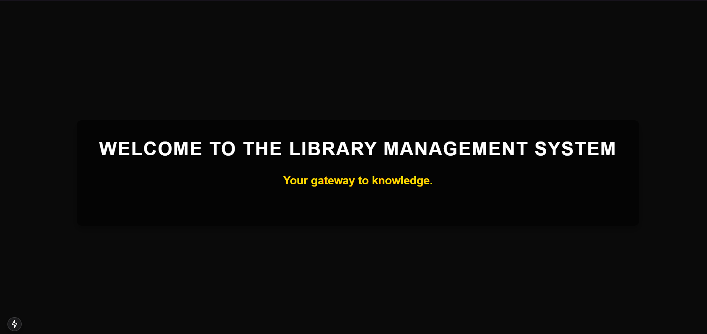
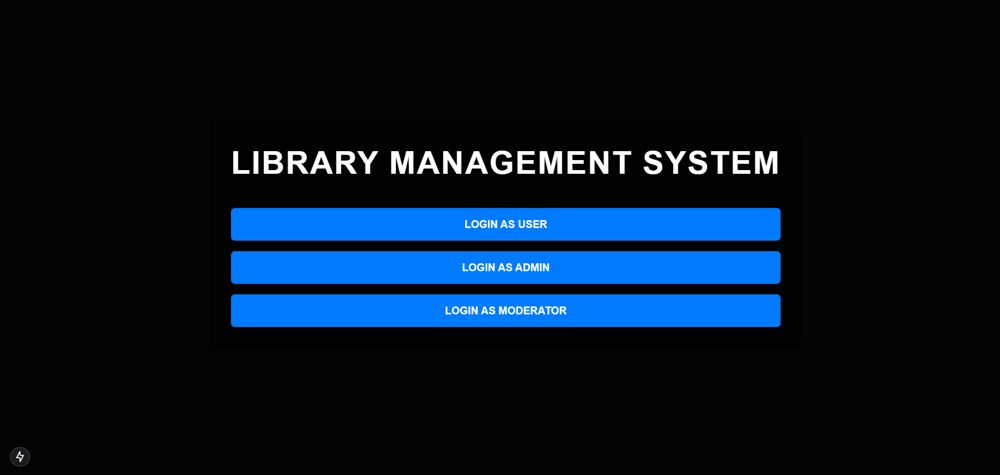
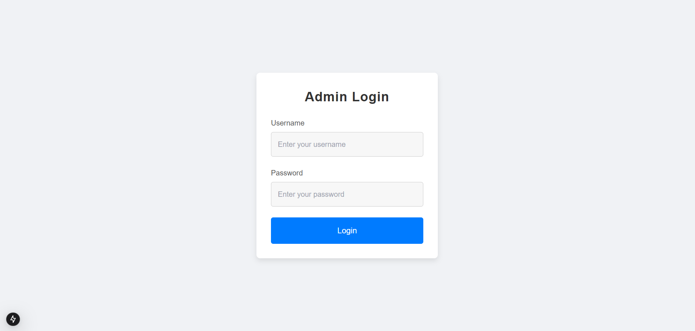
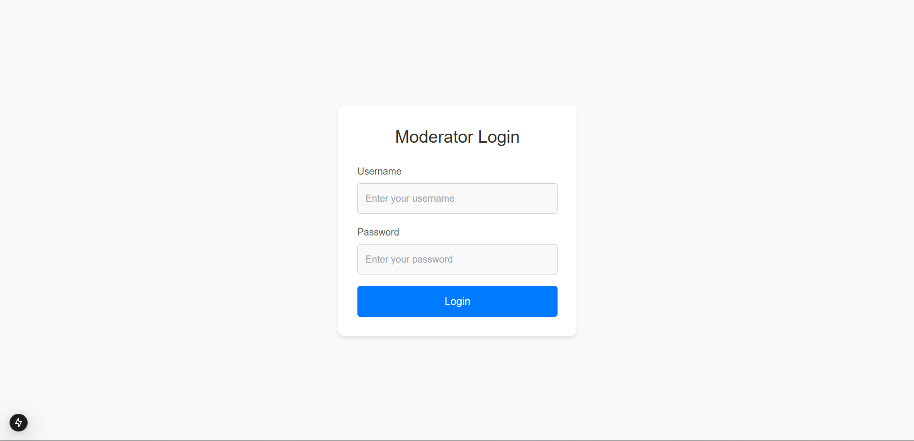
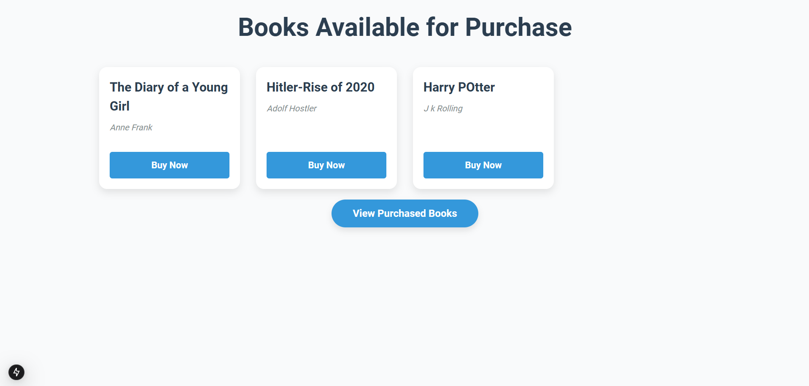
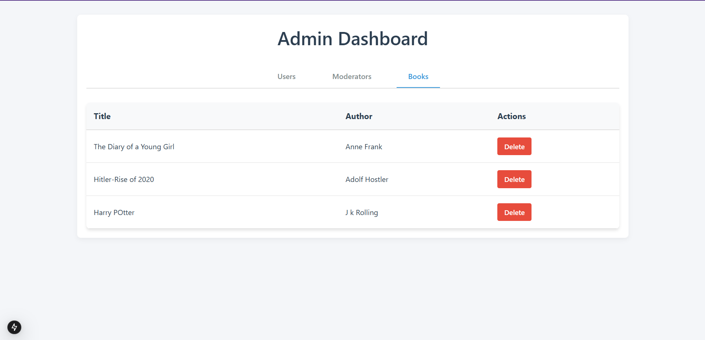
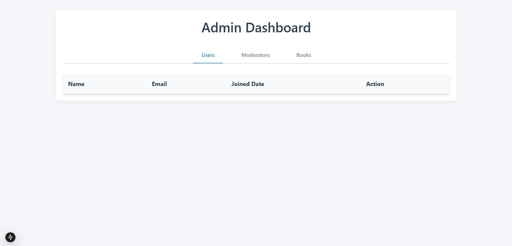
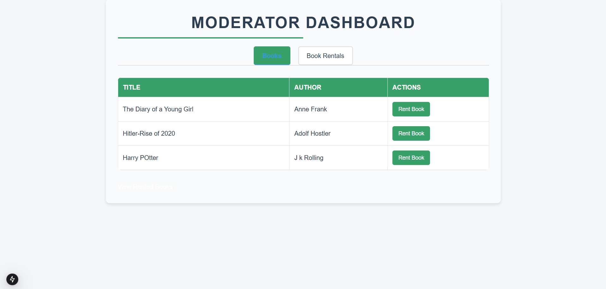

<h1 align="center" id="title">Library Management System</h1>

<p id="description">A robust web application designed to streamline library operations with a secure and scalable architecture. The system leverages FastAPI for a high-performance backend Next.js for an intuitive and responsive frontend and MongoDB for efficient data management. It incorporates Role-Based Access Control (RBAC) for fine-grained user permissions secure authentication with JWT/OAuth and advanced security measures like input validation and encrypted data handling. Key functionalities include book and user management activity tracking and a borrow-return system providing an end-to-end solution for modern library needs.</p>

<p align="center"></p>

  
  
<h2>🧐 Features</h2>

Here're some of the project's best features:

*   Authentication: Secure user authentication using JSON Web Tokens (JWT).
*   Authorization: Role-Based Access Control (RBAC) ensures only authorized users can access specific features.
*   Middleware Protection: APIs are secured based on user roles using dependency injection.
*   CORS Support: Enables secure communication between the frontend and backend.

<h2>🛠️ Installation Steps:</h2>

<h3>Setting Backend</h3>

<p>1. Clone the repository:</p>

```
git clone https://github.com/abhashgoyal/Library-Management-RBAC.git
cd Backend
```

<p>2. Activate the virtual environment:</p>

```
venv\Scripts\activate
```

<p>3. Install required dependencies:</p>

```
pip install -r requirements.txt
```

<p>4. Run the server:</p>

```
uvicorn main:app --reload
```

<h3>Setting Frontend</h3>

<p>1.  Navigate to the Frontend Directory:</p>

```
cd Library-Management-RBAC/Frontend
```
<p>2. Download frontend dependencies:</p>

```
npm install
```
<p>3. Run the Frontend:</p>

```
npm run dev
```
<p> Open the Application</p>

```
http://localhost:3000
```
  
<h2>💻 Built with</h2>

Technologies used in the project:

*   Backend Framework: FastAPI
*   Frontend Framework: Next.js
*   Database: MongoDB
*   API Documentation: Swagger (auto-generated by FastAPI)
*   Authentication: JWT (JSON Web Tokens)

<h2>🎦 Travelling to the Project:</h2>

#### 1. **Landing Page **
   

#### 2. **Role Selections**
      

#### 3. **USER Login Page**
   

#### 4. **ADMIN Login Page**
   

#### 5. **MODERATOR Login Page**
   

#### 6. **User Dashboard**
   
   
#### 6. **User Dashboard 2**
   

#### 7. **Admin Management**
   
   
#### 8. **Admin Management 2**
   
   
#### 9. **Moderator Management**
   

### 🚧 Future Roadmap
- Implement user notification system.
- Add book reservation functionality.
- Enhance user analytics for admins.
- Integrate search functionality with advanced filters.

### 🙏 Acknowledgments
- FastAPI for providing a high-performance backend framework.
- Next.js for an intuitive and easy-to-use frontend framework.
- MongoDB for offering a scalable NoSQL database solution.

<h2>Thank You VRV Security For Provoding me this oppourtunity</h2> 
<h2>VRV Security’s Backend Developer Intern Assignment</h2>

Devloped with love by Abhash Goyal<p>https://www.linkedin.com/in/abhashgoyal-4692b91b8/</p>
<p>abhashgoyal200@gmail.com</p>
